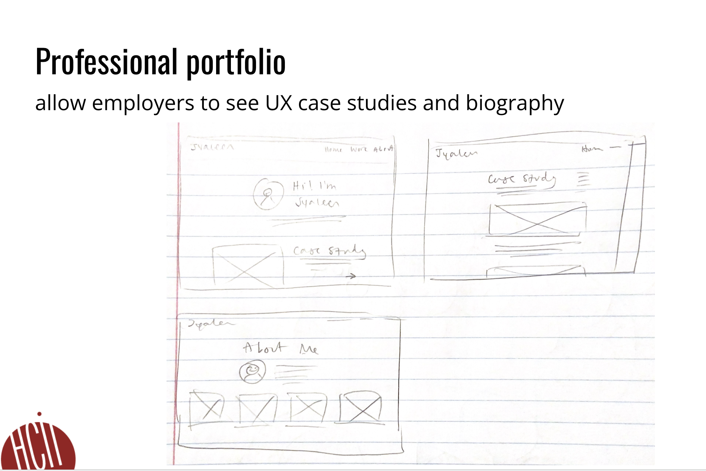
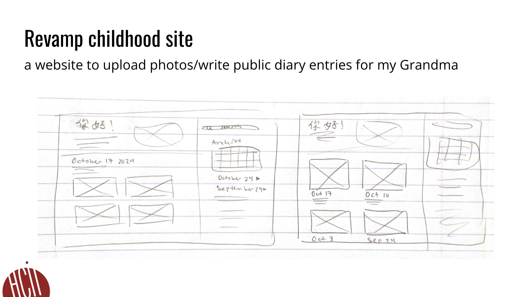
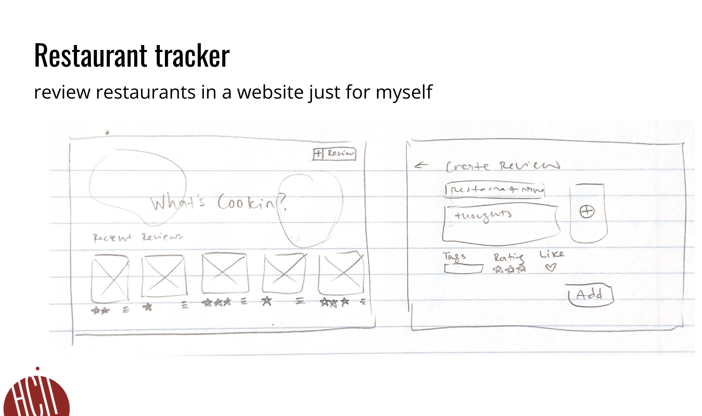

# FP1 - Proposal for Critique

### Idea 1: Portfolio 

The basic idea of my first final project idea is to create a personal UX/UI portfolio website. I plan to make this design interactive by incorporating  scroll-based animations and micro-interactions. To ensure accessibility, I'll use semantic HTML, design for screenreaders, add descriptive alt text, choose colors that contrast well with each other, incorporate scalable text, and overall aim to adhere to WCAG guidelines. I want to include case studies, my work experience, skills and tools, and a biography in this website. 

### Idea 2: Revamping Childhood Website

My second project idea is to revamp a website/blog my mom made when I was a kid where she uploaded photos and wrote diary entries throughout my childhood, primarily for family to visit. I plan to make my design interactive and engaging by incorporating micro-interactions and animations. I will use semantic HTML, design for screenreaders, add descriptive alt text, choose colors that contrast well with each other, incorporate scalable text, and overall aim to adhere to WCAG guidelines in order to ensure accessibility. I will include pictures and diary entries in my website, as well as the functionality to add new ones.

### Idea 3: Personal Restaurant Rating/Tracking 

My third project idea is to create a personal restaurant tracking/rating website, kind of like Letterboxd with no other users, but for food. I will make my design interactive and engaging by including a customizable rating system, dynamic review summaries, and including interactive maps. Like my previous two ideas, I will use semantic HTML, design for screenreaders, add descriptive alt text, choose colors that contrast well with each other, incorporate scalable text, and overall aim to adhere to WCAG guidelines in order to ensure accessibility. The information I want to convey is the restaurant and menu, the location, my thoughts, and videos and photos I upload.

## Feedback Summary
Almost all the feedback I received were directed at Idea 2 and 3. I mentioned that I was unsure about Idea 2, as since I would be designing for primarily older people who is not a digital native, I feared I would not have much room for exploration, and that I'd be limited to following existing heuristics and best-practicecs for designing for an older audience. However, someone mentioned that it was actually a really good opportunity to explore designing for aging, and that it's a really interesting constraint to work with, and that there's always room for innovation. He wondered if it could be something similar to how Apple's Photos app makes "For You" photo memory compilations. People also mentioned how it would be an opportunity to integrate a maps API and geo-locate memories. 

As for Idea 3, I got a tip to look more into the Beli app, which is very similar to what I want to do, albeit only offered as a mobile app and is not supported as a website/desktop app. A really interesting idea someone came up with was to explore hover interactions; with restaurants I log, I would be able to hover over a restaurant card, and be able to see the photos/videos I took. 

## Feedback Digestion
Moving forward, I plan to focus on Idea 3 and integrate hover interactions, as they can make the interface feel more responsive and visually appealing without overwhelming the user with content. This approach also distinguishes my project from Beli and other mobile-only options, since I can leverage web-only interactions. I will also explore the Beli app's design to understand its strengths and limitations, which will help me refine my user experience to stand out.

As for Idea 2, I recognize the potential in designing for an aging audience and will keep it as a future project, but I want to prioritize Idea 3, which offers more design freedom and aligns better with the kind of interactive experience I envision. I also think I want to keep my chidhood site as it exists right now!
