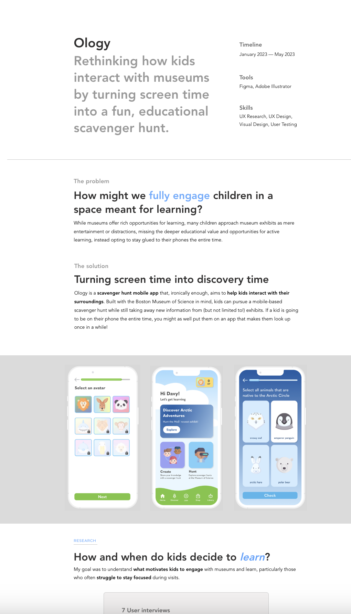

# **FP2 \- Evaluation of the Final project**

## Project Description

For my project, I'm planning to create a personal UX/UI portfolio website to showcase case studies. My motivation for this is because I want a space where I can show the projects I have worked on. I already have a portfolio, but this project will give me an opportunity to explore a new design direction. 

## High-Fi Prototypes

### *Prototype 1*

Some of the actionable feedback I got regarding the homepage prototype was that the current hero is too simple and not particularly memorable, and adding something more visually interesting would be helpful (the fish is interesting, but there is nothing dynamic). Also, displaying only one case study per horizontal line might cause excessive scrolling if I am planning to add many projects. I also got feedback to consider incorporating a serifed font, since I am currently using two sans serifs. 

### *Prototype 2*

The actionable feedback I got on the Ology case study page was that the subheadings might be too subtle because they are gray, and that I should consider making them more prominent so they are easily noticeable. Also, instead of static images, I could consider inforporating GIFs or live prototypes to show designs in action. Also, a user wondered if there was a more dynamic way to break up the different sections of my case study, rather than simply using horizontal lines, which might seem a bit boring.

## Usability Test

The process for my user testing went as follows: I gave them an overview of my project, as well as what I hoped for my portfolio to achieve. Then, I asked them to click through the screens I had, and think aloud while doing so, giving any feedback that comes to mind.

The feedback I got during the evaluation was that:

1.  The screens are too simple and not particularly memorable. Adding unique visual elements could enhance memorability.
2. Consider incorporating a serif font to pair with your current sans-serif, adding contrast and visual interest. A mix of serif and sans-serif fonts could work well instead of using two sans-serif options.
3. Displaying only one case study per horizontal line might cause excessive scrolling if you have many projects. Explore alternative layouts to minimize this.
4. Replace the name "Ology”, etc. with a short tagline or descriptive phrase to immediately inform viewers about the project's nature.
5. The subheadings might be too subtle; consider making them more prominent so they are easily noticeable and contribute to the structure.
6. Instead of static images, consider incorporating GIFs or live prototypes to bring your case studies to life and show your designs in action.

I think that all of these points of feedback are actionable, though I haven't been able to explore all of them just yet. I did play around with different serif fonts, however, and I think I will continue down that path.

## Updated Designs

In the following screen, I explored possible serif font options that would look good with the sans serif fonts I had chosen. I ended up deciding on Playfield Display, and I replaced some of my headings with it. I also replaced the gray subheadings for "The Problem" and "The Solution" with a different style, which I think lowers its visual importance. The feedback I had received was that the gray subheadings were *too* gray and thus people's eyes glossed over it, but that is what I want — it is secondary information, and what they should be focusing on is the main section heading. So, to make it less obvious that this is something to be read, I made it more inconspicuous, so that users don't perceive that they are missing any information if they don't read it.

## Feedback Summary

The two points of feedback I got from the lab session were that I should explore how to make my project more interactable, and an idea someone had was to make the first in my hero section follow the cursor, which I thought was a really clever idea. The feedback made me consider how an interactive design might encourage users to actively explore the content rather than just passively scroll through it.

A suggestion brought up by another classmate after hearing the first point of feedback, which I really liekd, was to make the fish element in my home hero section follow the cursor. I think that would be a really fun interaction to have. This idea inspired me to further explore how to add subtle, responsive animations that would allow users to feel a sense of direct connection with my portfolio. It would help make my portfolio feel more playful, which is what I want, and would draw users in right from the start. I don't love micro-interactions, but this idea encouraged me to consider adding some to create a cohesive interactive experience.

## Milestones

Outline weekly milestones to plan your expected implementation progress until the end of the semester (\~300 words). 

### *Implementation Plan*

- [ ] Week 9 Oct 28 \- Nov 1:
  - [X] FP1 due
  
- [ ] Week 10 Nov 4 \- Nov 8:   
  - [ ] FP2 due
  - [X] Explore JS libraries

- [ ] Week 11 Nov 11 \- Nov 15:  
  - [ ] Work on homepage
  - [ ] Revisit case study hi-fis to determine if I want to change anything before beginning development
    - [ ] Potentially more user testing

- [ ] Week 12 Nov 18 \- Nov 22:   
  - [ ] Work on first case study page
  - [ ] Work on second case study page

- [ ] Week 13 Nov 25 \- Nov 29:  
  - [ ] Work on third case study page
  - [ ] Thanksgiving  
- [ ] Week 14 Dec 2 \- Dec 6:  
  - [ ] Finishing touches
  - [ ] FP4 due 

### *Libraries and Other Components*

* React.js

## Generative AI Use Plan

I might use GenAI to come up with filler content for my portfolio case studies if I have not written them yet. I don't think I will be using much GenAI for the coding aspect of this project, since I only have access to ChatGPT, and I think ChatGPT is still lacking in the coding department. 

### *Tool Use*

* ChatGPT  
  * I will use it for writing content to go in my case studies because it can help me save time and finish this project on time, and I can go back and edit the content later on when I have more time.  
  * I will not use it for coding because it might not be able to help me with getting correct, clean code.
* GitHub Copilot  
  * I will use it for leading me in certain coding directions because it can help with determining the best next course of action
  * I will not use it blindly because Copilot doesn't know what I envision for the end product; only I do.

### *Responsible Use*

I will use genAI responsibly by making sure it doesn't dictate any of my design or coding decisions; genAI should be used as a helping hand, not a crutch. I might ask genAI for feedback regarding my existing code and if I can make it cleaner, or for ideas on making it more accessible, but I will never ask genAI to actually generate my code for me. If I do make changes based on feedback I received from genAI, I will document it in my code. I'm also responsible for the accuracy of the information given to me by genAI that I do choose to incorporate into my project. 

-- --

# FP1 - Proposal for Critique

### Idea 1: Portfolio 

The basic idea of my first final project idea is to create a personal UX/UI portfolio website. I plan to make this design interactive by incorporating  scroll-based animations and micro-interactions. To ensure accessibility, I'll use semantic HTML, design for screenreaders, add descriptive alt text, choose colors that contrast well with each other, incorporate scalable text, and overall aim to adhere to WCAG guidelines. I want to include case studies, my work experience, skills and tools, and a biography in this website. 

### Idea 2: Revamping Childhood Website

My second project idea is to revamp a website/blog my mom made when I was a kid where she uploaded photos and wrote diary entries throughout my childhood, primarily for family to visit. I plan to make my design interactive and engaging by incorporating micro-interactions and animations. I will use semantic HTML, design for screenreaders, add descriptive alt text, choose colors that contrast well with each other, incorporate scalable text, and overall aim to adhere to WCAG guidelines in order to ensure accessibility. I will include pictures and diary entries in my website, as well as the functionality to add new ones.

### Idea 3: Personal Restaurant Rating/Tracking 

My third project idea is to create a personal restaurant tracking/rating website, kind of like Letterboxd with no other users, but for food. I will make my design interactive and engaging by including a customizable rating system, dynamic review summaries, and including interactive maps. Like my previous two ideas, I will use semantic HTML, design for screenreaders, add descriptive alt text, choose colors that contrast well with each other, incorporate scalable text, and overall aim to adhere to WCAG guidelines in order to ensure accessibility. The information I want to convey is the restaurant and menu, the location, my thoughts, and videos and photos I upload.

## Feedback Summary
Almost all the feedback I received were directed at Idea 2 and 3. I mentioned that I was unsure about Idea 2, as since I would be designing for primarily older people who is not a digital native, I feared I would not have much room for exploration, and that I'd be limited to following existing heuristics and best-practicecs for designing for an older audience. However, someone mentioned that it was actually a really good opportunity to explore designing for aging, and that it's a really interesting constraint to work with, and that there's always room for innovation. He wondered if it could be something similar to how Apple's Photos app makes "For You" photo memory compilations. People also mentioned how it would be an opportunity to integrate a maps API and geo-locate memories. 

As for Idea 3, I got a tip to look more into the Beli app, which is very similar to what I want to do, albeit only offered as a mobile app and is not supported as a website/desktop app. A really interesting idea someone came up with was to explore hover interactions; with restaurants I log, I would be able to hover over a restaurant card, and be able to see the photos/videos I took. 

## Feedback Digestion
Moving forward, I plan to focus on Idea 3 and integrate hover interactions, as they can make the interface feel more responsive and visually appealing without overwhelming the user with content. This approach also distinguishes my project from Beli and other mobile-only options, since I can leverage web-only interactions. I will also explore the Beli app's design to understand its strengths and limitations, which will help me refine my user experience to stand out.

As for Idea 2, I recognize the potential in designing for an aging audience and will keep it as a future project, but I want to prioritize Idea 3, which offers more design freedom and aligns better with the kind of interactive experience I envision. I also think I want to keep my chidhood site as it exists right now!
