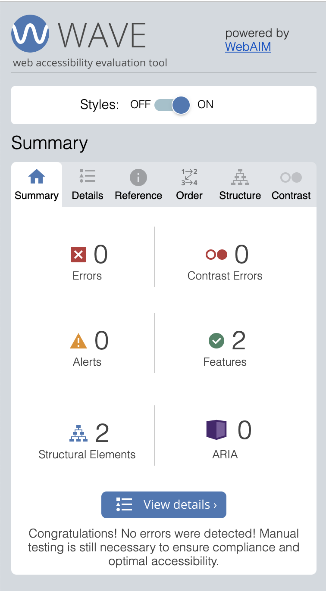
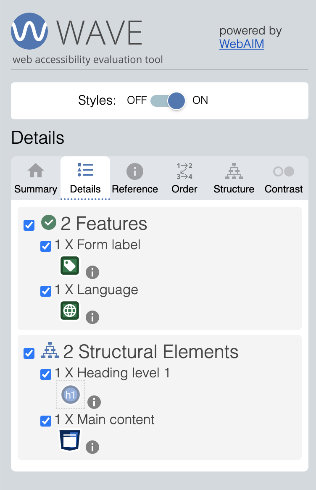
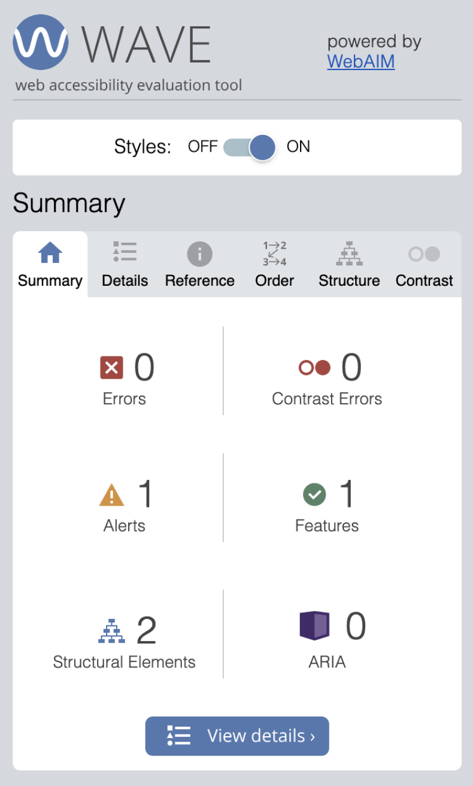
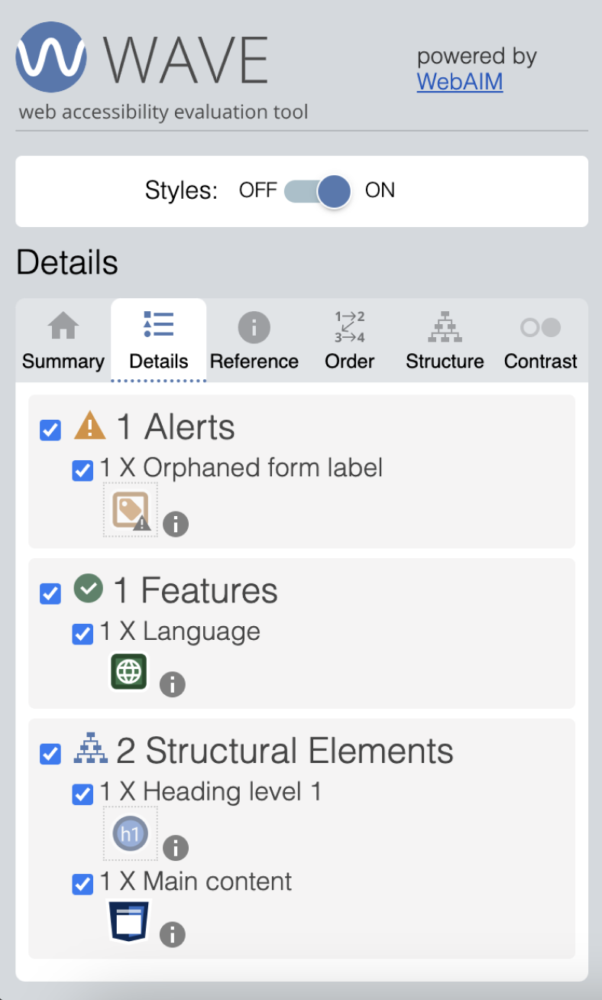

# **FP4 \- Final Project Writeup**

## Part 1: Website Description

Describe your website (300 words).

What is the purpose of your website?   
* The purpose of my website is to create a playful and interactive experience that combines typography and visual art. It allows users to explore words in a dynamic way, as they can change the visual aspects of them in real-time. It's not just about displaying words, but also inviting people to engage with them in a fun, tactile way. They can either opt out of inputting their own words and just interact with the website without customization, or they can personalize the content by adding their own words. 

Who is the target audience?
* The target audience is anyone who enjoys interactive digital experiences. This could be artists, designers, students, or casual internet users who like to experiment with technology and visual design. It's also appealing to people with an interest in typography and abstract visuals. Because it is a simple website, it's accessible to users of all ages, making it a broad and diverse audience.

What information do you convey with your website?
* The website demonstrates that words aren't just tools for communication, but can also be dynamic and be visually interesting, too. By combining interactivity and customization, I'm hoping to push users to rethink how they engage with text, making words feel alive.

How is it interesting and engaging?
* It's engaging because it constantly evolves. Every second, a new word appears, creating a sense of anticipation. Users can reshape the words with their mouse movements and keyboard selections, which makes user interaction tactile and personal. All four quadrants--large and close together, small and close together, large and scattered, and small and scattered--have different visual appeals to them that are fun to see. Also, being able to change the opacity with keyboard inputs offers 9 different ways to experience each 4 quadrants. Also, the option to input their own words keeps the experience fresh and unique. The bubble-like aesthetic adds and element of whimsy, adding to the delight of using the website. 

## Part 2: User Interaction

How a user would interact with your website? For each step, briefly but clearly state the interaction type & how we should reproduce it.

1. Interaction type. Click on X on page Y / scroll on page X, etc.  
2. Hover. Hover over buttons to see a dropshadow indicating you are hovering over it.
3. Input Field. Input your own list of words into the input field in the directions page. 
4. Click. Double click anywhere on the directions page to start the animation if you do not input your own list of words.
5. Click. Click on the "view directions" button to see a pop-up modal of the directions in the words animation page. 
6. Mouseover. Move mouse along X-axis to change how scattered the dots are.
7. Mouseover. Move mouse along Y-axis to change how small and uniform the dots are.
8. Keyboard. Press keys 1-9 to change the opacity of the dots.
8. Keyboard. Press the space bar to change between grayscale and colorscale. 1 on the colorscale should be pink, 9 on the colorscale should be dark gray. 1 on the grayscale should be white, 9 on the grayscale should be dark gray.

## Part 3: External Tool

Describe what important external tool you used (JavaScript library, Web API, animations, or other). Following the bulleted list format below, reply to each of the prompts.

1. Name of tool1  
   * Why did you choose to use it over other alternatives? (2 sentences max)  
   * How you used it? (2 sentences max)  
   * What does it add to your website? (2 sentences max)  
2. Name of tool2

## Part 4: Design Iteration

Describe how you iterated on your prototypes, if at all, including any changes you made to your original design while you were implementing your website and the rationale for the changes. (4-8 sentences max)

## Part 5: Implementation Challenge

What challenges did you experience in implementing your website? (2-4 sentences max)

## Part 6: Generative AI Use and Reflection

Describe how you used Generative AI tools to create this final project (fill in the following information, write \~500 words in total).

Document your use of all GenAI tools — ChatGPT, Copilot, Claude, Cursor, etc. using the template below. Add/Delete rows or bullet points if needed, and replace Tool1/Tool2 with the name of the tool.

### Usage Experiences by Project Aspects

Feel free to edit the column \_ (other?) or add more columns if there's any other aspect in your project you've used the GenAI tools for.

For the following aspects of your project, edit the corresponding table cell to answer:
- *Usage*: Whether you used / did not use this tool for the aspect. Enter [Yes/No]
- *Productivity*: Give a rating on whether this tool makes your productivity for X aspect [1-Much Reduced, 2-Reduced, 3-Slightly Reduced, 4-Not Reduced nor Improved, 5-Slightly Improved, 6-Improved, 7-Much Improved].

| Tool Name | Ratings | design | plan | write code | debug | \_ (other?) |
| :---- | :---- | :---- | :---- | :---- | :---- | :---- |
| Tool1 | Usage | Yes/No | Yes/No | Yes/No | Yes/No | Yes/No |
| Tool1 | Productivity | 1~7 | 1~7 | 1~7 | 1~7 | 1~7 |
| Tool2| Usage | Yes/No | Yes/No | Yes/No | Yes/No | Yes/No |
| Tool2 | Productivity | 1~7 | 1~7 | 1~7 | 1~7 | 1~7 |

### Usage Reflection

> Impact on your design and plan 
* It matched my expectations and plan in [FP2](#generative-ai-use-plan) in that … For example, 
  1. Tool1: 
  2. Tool2:
* It did not match my expectations and plan in [FP2](#generative-ai-use-plan) in that … For example, 
  1. Tool1: 
  2. Tool2:
* GenAI tool did/did not influence my final design and implementation plan because … For example, 
  1. Tool1: 
  2. Tool2:

> Use patterns
* I accepted the generations when …  For example, 
  1. Tool1: this tool once suggested … and I adjusted my design according to the suggestion because … 
  2. Tool2: 
* I critiqued/evaluated the generated suggestions by … For example, 
  1. Tool1: this tool once suggested … but I modified/rejected the suggestion because … 
  2. Tool2: 

> Pros and cons of using GenAI tools
* Pros
  1. Tool1: 
  2. Tool2:
* Cons
  1. Tool1: 
  2. Tool2:

### Usage Log

Document the usage logs (prompts and chat history links) for the GenAI tools you used. Some tools may not have an easy way to share usage logs, just try your best! Some instructions for different tools:

1. [ChatGPT](https://help.openai.com/en/articles/7925741-chatgpt-shared-links-faq) / [Gemini](https://support.google.com/gemini/answer/13743730?hl=en&co=GENIE.Platform%3DDesktop): share the anonymous link to all of your chat histories relevant to this project
2. [GitHub Copilot (VSCode)](https://code.visualstudio.com/docs/copilot/copilot-chat#:~:text=You%20can%20export%20all%20prompts%20and%20responses%20for%20a%20chat%20session%20in%20a%20JSON%20file%20with%20the%20Chat%3A%20Export%20Session...%20command%20(workbench.action.chat.export)%20in%20the%20Command%20Palette.): export chat histories relevant to this project.

## Appendix

Screenshots from WAVE:

Directions screen:

Words screen:

